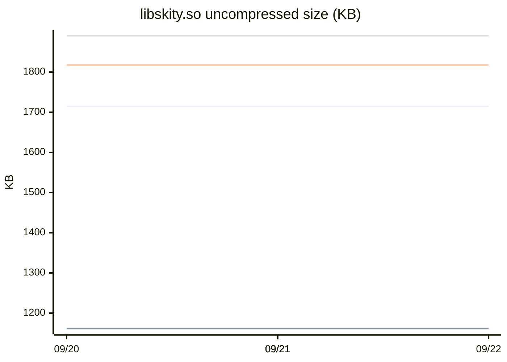
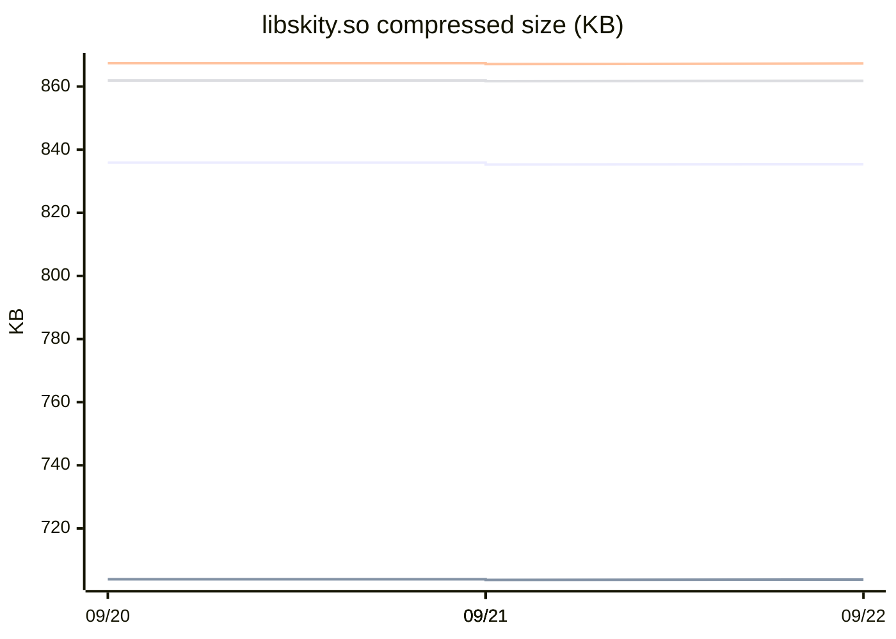

# skity binary size trend

> This branch is updated automatically by CI; do not edit manually.

## Latest snapshot

| ABI | Uncompressed | Compressed |
|---|---:|---:|
| arm64-v8a | 1.67 MB | 835.4 KB |
| armeabi-v7a | 1.13 MB | 703.8 KB |
| x86 | 1.78 MB | 867.3 KB |
| x86_64 | 1.85 MB | 861.8 KB |

Latest commit: `93a947534d`

## Uncompressed size trend

## Compressed size trend

