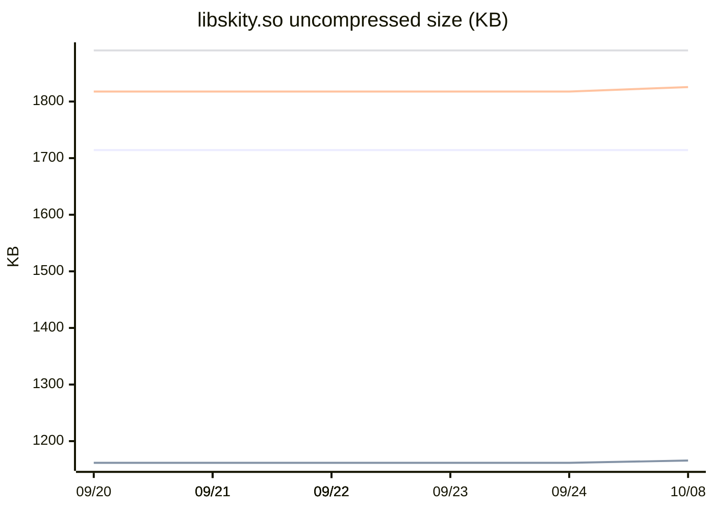
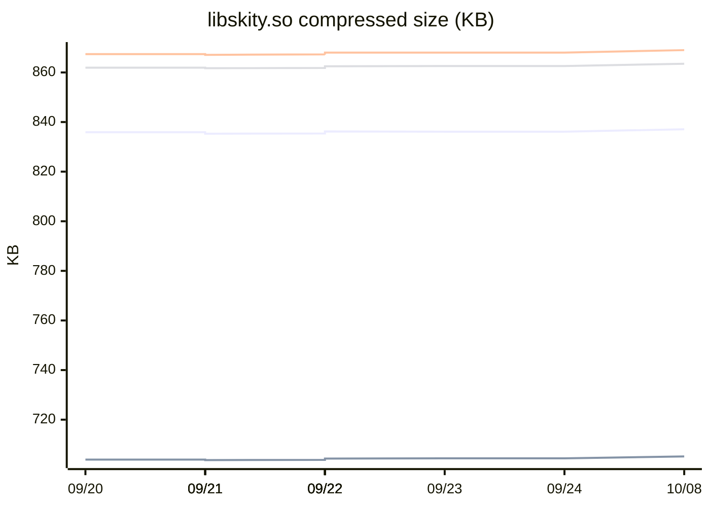

# skity binary size trend

> This branch is updated automatically by CI; do not edit manually.

## Latest snapshot

| ABI | Uncompressed | Compressed |
|---|---:|---:|
| arm64-v8a | 1.67 MB | 837.1 KB |
| armeabi-v7a | 1.14 MB | 705.2 KB |
| x86 | 1.78 MB | 869.0 KB |
| x86_64 | 1.85 MB | 863.5 KB |

Latest commit: `e2e2cbd8d4`

## Uncompressed size trend

```mermaid
xychart-beta
    title "libskity.so uncompressed size (KB)"
    x-axis ["09/20", "09/21", "09/21", "09/21", "09/22", "09/22", "09/22", "09/22", "09/23", "09/24", "10/08"]
    y-axis "KB"
    line "arm64-v8a" [1714.3, 1714.3, 1714.3, 1714.3, 1714.3, 1714.3, 1714.3, 1714.3, 1714.3, 1714.3, 1714.3]
    line "armeabi-v7a" [1161.7, 1161.7, 1161.7, 1161.7, 1161.7, 1161.7, 1161.7, 1161.7, 1161.7, 1161.7, 1165.7]
    line "x86" [1817.6, 1817.6, 1817.6, 1817.6, 1817.6, 1817.6, 1817.6, 1817.6, 1817.6, 1817.6, 1825.6]
    line "x86_64" [1890.3, 1890.3, 1890.3, 1890.3, 1890.3, 1890.3, 1890.3, 1890.3, 1890.3, 1890.3, 1890.3]
```

## Compressed size trend

```mermaid
xychart-beta
    title "libskity.so compressed size (KB)"
    x-axis ["09/20", "09/21", "09/21", "09/21", "09/22", "09/22", "09/22", "09/22", "09/23", "09/24", "10/08"]
    y-axis "KB"
    line "arm64-v8a" [835.9, 835.9, 835.3, 835.3, 835.4, 835.6, 835.6, 836.2, 836.1, 836.1, 837.1]
    line "armeabi-v7a" [703.9, 703.9, 703.7, 703.7, 703.8, 703.9, 703.9, 704.3, 704.4, 704.4, 705.2]
    line "x86" [867.4, 867.4, 867.1, 867.1, 867.3, 867.3, 867.2, 868.0, 868.0, 868.0, 869.0]
    line "x86_64" [861.9, 861.9, 861.7, 861.7, 861.8, 861.8, 861.9, 862.5, 862.6, 862.6, 863.5]
```
